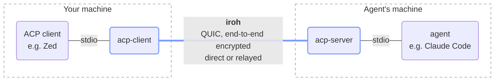

# iroh-acp-rs

[](https://github.com/carsonfarmer/iroh-acp-rs/actions/workflows/test.yml)
[](https://github.com/carsonfarmer/iroh-acp-rs/actions/workflows/lint.yml)
[](https://github.com/carsonfarmer/iroh-acp-rs/blob/main/.regenerate/README.md)

Run an [Agent Client Protocol](https://agentclientprotocol.com) (ACP) agent on one
machine and use it from an editor on another, peer to peer over
[iroh](https://github.com/n0-computer/iroh). There are no open ports, no VPN and no
server in the middle.



It is two small binaries and a Rust library, built almost entirely from
[iroh](https://github.com/n0-computer/iroh) and
[agent-client-protocol](https://github.com/agentclientprotocol/rust-sdk), the official
Rust implementation of ACP. The library is under 100 lines of code, and each binary is
under 50.

It is a port of [iroh-acp-go](https://github.com/carsonfarmer/iroh-acp-go). The two
share one spec, speak the same protocol and read the same key files, so a Go client
works with a Rust server and the other way round. The repository also keeps what an
agent needs to write the code again: a
[spec, a decision log, a prompt and the tests that judge the result](.regenerate/README.md).

## Why

Editors such as Zed start ACP agents as local subprocesses and talk to them over stdio.
That's fine until the agent should run somewhere else: on a big dev box, next to a
repository, or on a machine that holds the credentials. The usual answers are SSH
tunnels, port forwarding or a VPN.

iroh gives each process a public-key identity and connects two of them from anywhere.
It punches through NATs where it can and falls back to relays where it can't, and the
connection is always end-to-end encrypted. This project carries ACP over that
connection, so the editor still just launches a local command: `acp-client`.

## How it works

- **Identity.** Each endpoint has an Ed25519 key, and its public half is the endpoint
  ID. Both binaries save their key to a file, so IDs survive restarts.
- **Addressing.** `acp-server` prints an *endpoint ticket*. The ticket holds the
  server's ID, its home relay and its current direct addresses. Because the ID is
  stable, a ticket keeps working after the server restarts.
- **Connectivity.** `acp-client` dials the ticket and iroh picks the path. It connects
  directly when it can and goes through the [n0](https://n0.computer) public relays
  when it can't. Relays forward only encrypted QUIC packets.
- **Access control.** The QUIC handshake proves the client's ID. The server checks
  that ID against its allowlist before it starts anything, and disconnects other peers
  with "not allowed".
- **Framing.** Each ACP connection is one bidirectional QUIC stream, under the ALPN
  `acp/1`. The stream carries ACP's usual newline-delimited JSON-RPC, byte for byte.
  So both binaries are plain pipes, and any stdio agent and any ACP client work
  unchanged.
- **Lifecycle.** The server runs one agent process per connection:
  - When the editor closes the agent's stdin, `acp-client` half-closes the stream. The
    agent sees EOF and exits. The server then closes the stream, and `acp-client` sees
    EOF and exits.
  - If the editor kills `acp-client` outright, as Zed does, the connection times out
    10 to 15s later, and the agent's stdin closes.
  - iroh sends keepalives every 5s, so a quiet but live session stays up.

## Install

Needs a Rust toolchain no older than the `rust-version` in `Cargo.toml`, on macOS or
Linux.

```bash
cargo install --locked --git https://github.com/carsonfarmer/iroh-acp-rs
```

This installs `acp-server` and `acp-client`.

## Quick start

To try it without a real agent, use the echo agent from this repository's tests. It
answers each prompt with its own text.

```bash
cargo build --release --examples
```

1. On the machine with the editor, print the client's ID:

   ```bash
   target/release/acp-client
   ```

2. On the machine with the agent, start the server and allow that ID. It prints a
   ticket:

   ```bash
   target/release/acp-server -allow <client-id> target/release/examples/echo
   ```

3. Back on the editor's machine, send the agent one ACP message, the way an editor
   would:

   ```bash
   echo '{"jsonrpc":"2.0","id":0,"method":"initialize","params":{"protocolVersion":1}}' |
     target/release/acp-client <ticket>
   ```

The agent's answer comes back across iroh. Then stdin closes, so the agent and
`acp-client` both exit, and the server logs `agent exited: exit status: 0`.

## Use a real agent from Zed

On the agent's machine:

```bash
acp-server -allow <client-id> npx -y @agentclientprotocol/claude-agent-acp
```

On the editor's machine, add this to Zed's `settings.json`, then pick "Remote Claude"
in the agent panel:

```json
{
  "agent_servers": {
    "Remote Claude": {
      "type": "custom",
      "command": "/absolute/path/to/acp-client",
      "args": ["<ticket>"]
    }
  }
}
```

Any other ACP client that launches agents from a command and arguments is set up the
same way.

The agent runs on the server's machine, so it reads and edits that machine's files.
ACP clients that serve `fs/*` and `terminal/*` requests handle those on the editor's
side.

## Commands

The flags follow Go's syntax, as in iroh-acp-go: `-key file`, `-key=file` and
`--key file` all work.

### acp-server

```
acp-server [-key file] -allow <client-id> [-allow ...] <agent-command> [args...]
```

| Flag | Default | Meaning |
| --- | --- | --- |
| `-allow` | required | A client ID to serve, as printed by `acp-client`. Repeat it to serve several clients. |
| `-key` | `<config dir>/iroh-acp/server.key` | The server's key file. It is created if it's missing. |

The server prints its ticket on stdout and logs to stderr, including the ID of each
client it rejects. The agent's stderr goes to the server's stderr.

### acp-client

```
acp-client [-key file]            # print this client's ID
acp-client [-key file] <ticket>   # bridge stdio to the agent at ticket
```

| Flag | Default | Meaning |
| --- | --- | --- |
| `-key` | `<config dir>/iroh-acp/client.key` | The client's key file. It is created if it's missing. |

`<config dir>` is the one iroh-acp-go uses:

- `~/Library/Application Support` on macOS,
- `$XDG_CONFIG_HOME` or `~/.config` on Linux.

Give each machine its own client key.

## Library

The `iroh_acp` crate gives agent-client-protocol agents and clients the same
transport, without subprocesses:

```rust
// Serve an agent to one client.
let key = iroh_acp::load_key("server.key")?;
let ep = iroh_acp::builder().secret_key(key).bind().await?;
println!("{}", EndpointTicket::new(ep.addr()));
let allow = iroh_acp::allow_ids(vec![client_id]);
tokio::spawn(async move { iroh_acp::serve_agent(&ep, allow, my_agent).await });

// Elsewhere: connect to it.
let transport = iroh_acp::connect_agent(&client_ep, &ticket).await?;
Client.builder().connect_with(transport, async |cx| { /* ... */ }).await?;
```

| Item | What it does |
| --- | --- |
| `builder()` | An iroh endpoint builder for ACP: the n0 relays and a 10s idle timeout. Change it like any iroh builder, for example to use your own relays. |
| `load_key(path)` | Loads a secret key, creating and saving one on first use. |
| `key_path(name)` | The default path of the key file `name`, in the config directory. |
| `dial(ep, ticket)` | Opens an ACP stream to a ticket, as iroh's send and receive halves. Finishing the send half closes only that side. |
| `serve(ep, allow, handle)` | Calls `handle` with each ACP stream from a peer that `allow` accepts. |
| `allow_ids(ids)` | The usual `allow`: accept exactly these endpoint IDs. |
| `serve_agent(ep, allow, new_agent)` | `serve` with a new agent from `new_agent` per stream. |
| `connect_agent(ep, ticket)` | `dial`, wrapped as a transport for an agent-client-protocol client. |

`allow` is any `Fn(EndpointId) -> bool`, so any other access policy is one closure
away.

## Security model

- **Only allowed clients get an agent.** The ID a client presents is authenticated by
  the QUIC TLS handshake, so it cannot be spoofed without the client's key.
- **Key files are credentials.** They are written with mode `0600`. Anyone holding a
  client's key can act as that client, so keep them private.
- **An allowed client can do whatever the agent can** on the server's machine. Coding
  agents run commands and edit files, so allow only clients you trust with that
  machine.
- **The ticket is an address, not a secret.** It grants nothing on its own, but it does
  contain the server's IP addresses.
- **Traffic is end-to-end encrypted.** Relays see which endpoints talk to each other,
  but not what they say.

## Development

```bash
cargo test -- --include-ignored             # all the tests, including relay-only and built-binary tests
cargo test                                  # loopback only, no network
cargo clippy --all-targets -- -D warnings
cargo fmt --check
```

The tests use only the public API and the built binaries. They never touch your real
key files.

- `serve_agent_connect_agent_direct` and `serve_agent_connect_agent_relay_only` run
  the library over direct loopback and over the n0 relays only. They check two
  concurrent agents and a rejected stranger.
- `serve_rejects_queued_stream` checks that a stream a stranger opened before `allow`
  turned it down is never served.
- `load_key` and `key_path` check that a key file is created with mode `0600`, loads
  the same key again, and lives in the config directory.
- `client_prints_its_id` and `usage_errors` run the binaries without a network.
- `binaries` runs `acp-server` with the echo agent, then drives `acp-client` the way
  an editor does. It covers:
  - clean shutdown,
  - a client that isn't allowed,
  - a client killed with SIGKILL, whose agent must exit within 20s,
  - a server restart that keeps the old ticket working.

CI runs these tests, the spec suite described below, clippy, rustfmt and cargo-audit
on every push and pull request. Dependabot keeps crates and actions up to date.
Coding agents should read [`AGENTS.md`](AGENTS.md) first.

## Regenerating this project

The code and its tests are one implementation, and a rebuild may replace them. In
[regenerative software](https://aicoding.leaflet.pub/3majnyfydzs2y) the durable
assets are the interfaces, the behavior and the tests that check them, and an agent
writes the implementation from them. This repository keeps those assets in
[`.regenerate/`](.regenerate), apart from the project:

- [`SPEC.md`](.regenerate/SPEC.md) says what the program must do, down to the API and
  the log lines. iroh-acp-go holds the same file.
- [`DECISIONS.md`](.regenerate/DECISIONS.md) says why the design is the way it is.
- [`PROMPT.md`](.regenerate/PROMPT.md) is the prompt for the agent that rebuilds it.
- The spec suite next to them checks an implementation against `SPEC.md`: its
  public API, its flags, its behavior on the wire and in the binaries, and its size.
  CI runs it on this code too, so the code and the spec stay in step. `cargo test`
  runs it with the other tests, and `cargo test --test spec` runs it alone.

To try a rebuild, follow [`.regenerate/README.md`](.regenerate/README.md). Each run,
passing or not, goes in the ledger in [`PROVENANCE.md`](.regenerate/PROVENANCE.md).

## Caveats and known issues

- A client that is killed leaves its agent running for 10 to 15s, until the connection
  times out.
- By default, peers that can't connect directly use n0's public relays. For production,
  give `builder()` your own relay configuration.
- It builds only on Unix, as the key files rely on Unix file modes.

## Acknowledgements

- [iroh](https://github.com/n0-computer/iroh) by n0.
- [agent-client-protocol](https://github.com/agentclientprotocol/rust-sdk), the
  official Rust SDK for ACP.
- The [Agent Client Protocol](https://agentclientprotocol.com) by Zed Industries.

## License

[MIT](LICENSE)
